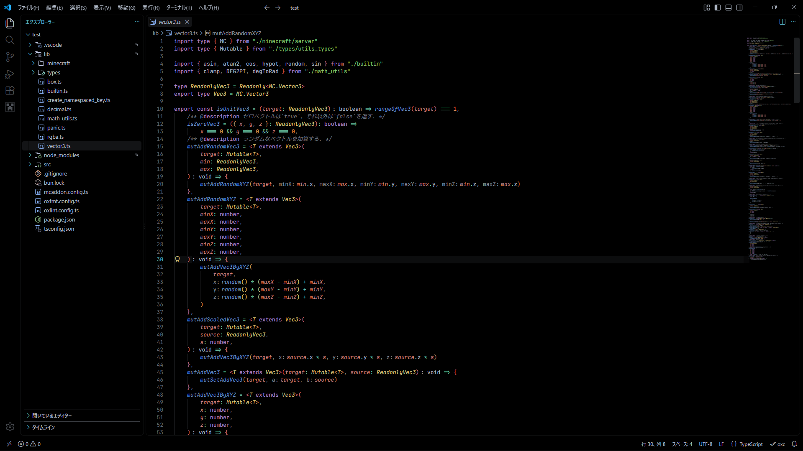

# my-favorite-vscode-theme
I made this because I wanted an even darker version of the Catppuccin theme for VS Code.

Please feel free to use it.



### Usage
1. [Install](https://marketplace.visualstudio.com/items?itemName=Catppuccin.catppuccin-vsc) Catppuccin for VSCode
2. Apply theme to Mocha
3. Open the VSCode JSON settings file and append the following sentence.
```jsonc
{
    // ...other settings
    "catppuccin.colorOverrides": {
        "mocha": {
            "rosewater": "#D7C2AE",
            "flamingo": "#D4AF9F",
            "pink": "#D7A4B9",
            "mauve": "#AD88C9",
            "red": "#D56D7A",
            "maroon": "#CD827E",
            "peach": "#DC9559",
            "yellow": "#DBC481",
            "green": "#88C573",
            "teal": "#76C4A7",
            "sky": "#6BBEBD",
            "sapphire": "#56A9BE",
            "blue": "#6B96CC",
            "lavender": "#96A0D0",
            "text": "#AFB8C6",
            "subtext1": "#AFB8C6",
            "subtext0": "#888F9A",
            "overlay2": "#757B84",
            "overlay1": "#61666E",
            "overlay0": "#4E5258",
            "surface2": "#3A3D42",
            "surface1": "#27292C",
            "surface0": "#131416",
            "base": "#000000",
            "mantle": "#000000",
            "crust": "#000000",
        }
    }
}
```
